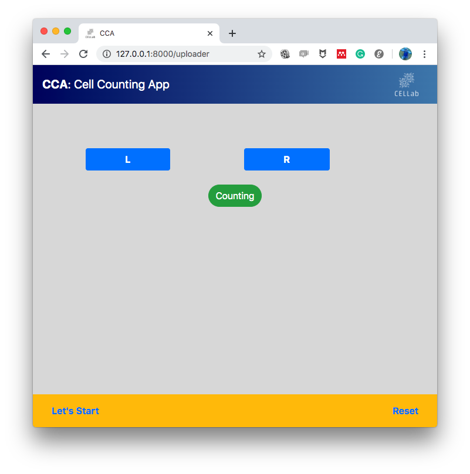
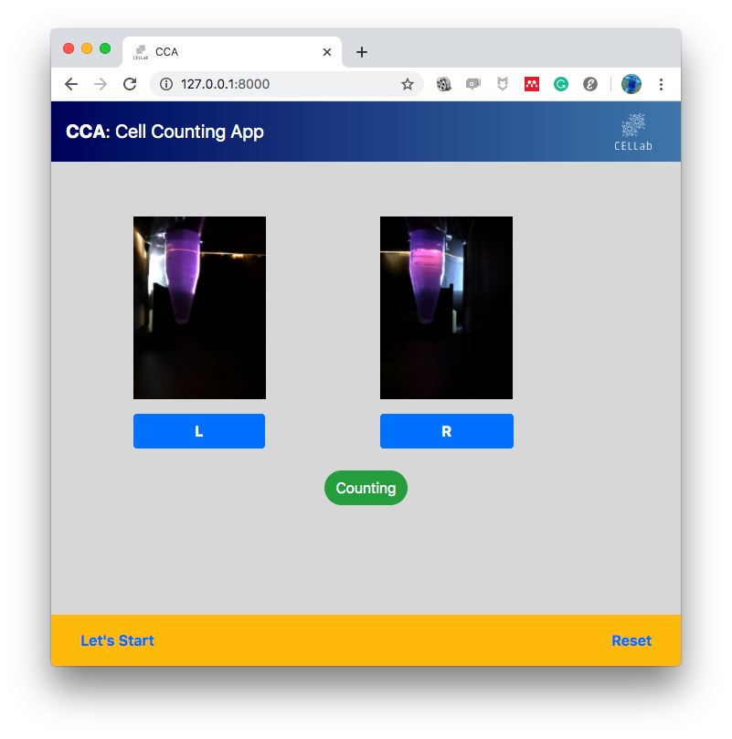
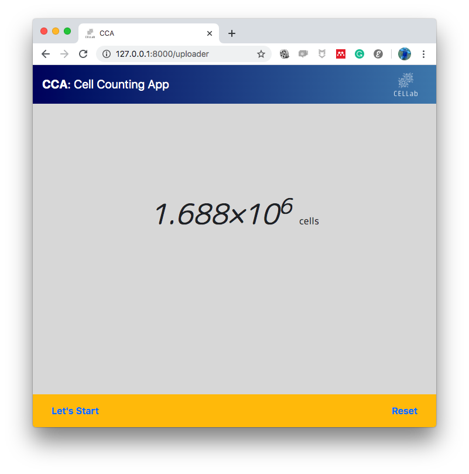

# CCAPP: Cell Counting Application

This is the code for ``Direct cell counting using macro-scale
smartphone images of cell aggregates.''  This project is carried out
in cooperation with [Funahashi lab](https://fun.bio.keio.ac.jp/) and
[Takemura lab](http://www.takemura.mech.keio.ac.jp/) at Keio
University.


## Overview

We present a novel cell counting method based on smartphone imaging
and image processing using convolutional neural networks. In this
method, cells are aggregated by centrifuging in a tube and imaged
using a smartphone. The tube image is taken by the smartphone inserted
into a special jig created by the 3D printer. The image is transferred
to a server, and the cell number is predicted using convolutional
neural networks on the server.


## Requirements

- [Python 3.6](https://docs.python.org/3.6/)
- [Chainer 4.0+](https://chainer.org/)
- [Matplotlib](https://matplotlib.org/)
- [NumPy](http://www.numpy.org)
- [scikit-image](http://scikit-image.org/)
- [Django 2.0+](https://www.djangoproject.com/)


## QuickStart

1. Download the this repository by `git clone`.
2. Download learned model.
3. Change directory to `CellCountingApp/ccapp`.
4. Run CCAPP.
    - On Linux:

        ```sh
        % git clone https://github.com/funalab/CellCountingApp.git
        % wget -P CellCountingApp/ccapp/app/core/models https://fun.bio.keio.ac.jp/software/CCAPP/reg.npz
        % cd CellCountingApp/ccapp
        % python manage.py runserver
        ```

    - On macOS:

        ```sh
        % git clone https://github.com/funalab/CellCountingApp.git
        % curl -o CellCountingApp/ccapp/app/core/models/reg.npz https://fun.bio.keio.ac.jp/software/CCAPP/reg.npz
        % cd CellCountingApp/ccapp
        % python manage.py runserver
        ```

        The local server will stand up and display the URL. Please
        copy and paste the URL into your web browser. After that, you
        will be redirected to the application screen (Figure 1).

        

        Figure 1. Screen of CCAPP on the web browser.

5. Input images and press the ``Counting'' button.

   Press the ``L'' button to select an input image. In an
   example, select `images/L.png` (Figure 2). Likewise, press the
   ``R'' button to select an input image. In an example, select
   `images/R.png` (Figure 2). Finally, press the ``Counting''
   button.

   
   
   Figure 2. Screen after inputting images.

   After a short time, the results of the cell count will be
   displayed on the screen (Figure 3).

   
   
   Figure 3. Screen showing the result of cell count.


## How to train and validation


1. Download and unzip the datasets.

    - On Linux:

        ```sh
        % cd CellCountingApp
        % wget -P . https://fun.bio.keio.ac.jp/software/CCAPP/datasets.zip
        % unzip datasets.zip
        ```

    - On macOS:

        ```sh
        % cd CellCountingApp
        % curl -o datasets.zip https://fun.bio.keio.ac.jp/software/CCAPP/datasets.zip
        % unzip datasets.zip
        ```

    Datasets directory will have the following structure:

    ```sh
    datasets/
      +-- train/
      |     +-- 01/
      |     |     +-- 1_01/
      |     |     |     +-- a.jpeg (Tube image of aggregated cells taken from the left side)
      |     |     |     +-- b.jpeg (Tube image of aggregated cells taken from the right side)
      |     |     +-- 1_02/
      |     |     +-- 1_03/
      |     |     +-- ...
      |     +-- 02/
      |     |     +-- ...
      |     +-- ...
      +-- test/
           +-- 1.8_1/
           |     +-- a.jpeg (Tube image of aggregated cells taken from the left side)
           |     +-- b.jpeg (Tube image of aggregated cells taken from the right side)
           +-- 1.8_2/
           +-- 1.8_3/
           +-- ...
    ```

2. Train CNN model with the above-prepared dataset.

    ```sh
    % sh scripts/run_train.sh
    ```

3. Inference on test dataset.

    ```sh
    % cp results/train*/best_loss_model ccapp/app/core/models/reg.npz
    % sh scripts/run_test.sh
    ```


# Acknowledgement

The development of this algorithm was funded by a JSPS KAKENHI Grant (Number JP16H04259, 16H04731, JP17H07081, 18J12482, and 19J13189)
and by the MEXT Grant-in-Aid for the Program for Leading Graduate Schools.